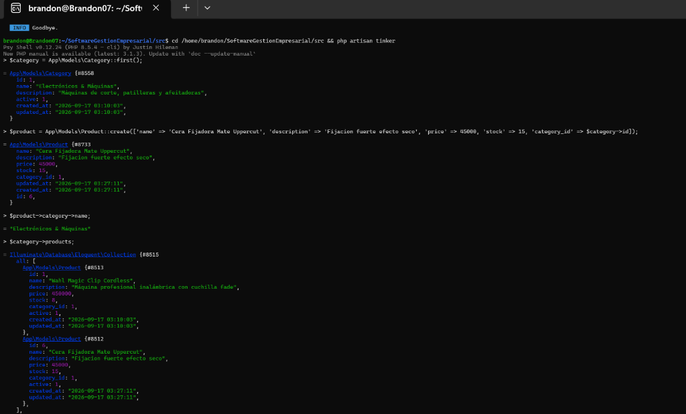
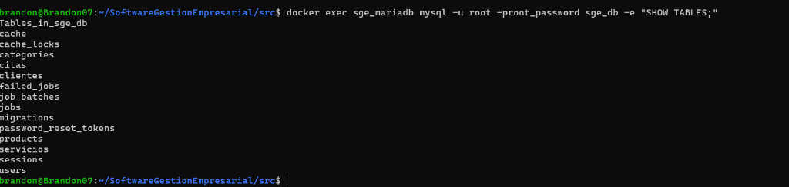
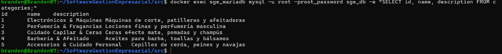

# Evidencias de Entrega — Clase 4: De la Teoría al Código
## Migraciones, Modelos Eloquent y Relaciones en el ERP

> **Institución:** COTECNOVA — Cartago, Valle del Cauca  
> **Asignatura:** Software de Gestión Empresarial (2026)  
> **Docente:** Jhon James Cano Sánchez  
> **Integrantes:** Brandon Cortés Giraldo & Johan  
> **Caso de Estudio:** Barbería y Perfumería JyM  
> **Repositorio Oficial:** [https://github.com/Brandon07-code/SoftwareGestionEmpresarial](https://github.com/Brandon07-code/SoftwareGestionEmpresarial)  

---

## 1. Resumen de la Actividad Realizada

En esta sesión se tradujeron las entidades del Diagrama Entidad-Relación (MER) a código funcional en Laravel 13 con Docker/MariaDB:

1. **Migraciones creadas con tipos de datos e integridad referencial:**
   * `categories`: Catálogo de categorías con campos `id`, `name`, `description`, `active`, `timestamps`.
   * `products`: Catálogo de productos con clave foránea `category_id` restringida (`constrained()->onDelete('cascade')`), precio decimal y stock.
   * Entidades ERP adicionales integradas: `clientes`, `servicios` y `citas`.

2. **Modelos Eloquent y Relación 1:N:**
   * Modelo [`Category`](../src/app/Models/Category.php) con propiedad `$fillable` y relación directa `hasMany(Product::class)`.
   * Modelo [`Product`](../src/app/Models/Product.php) con propiedad `$fillable` y relación inversa `belongsTo(Category::class)`.

3. **Población de Datos (Seeders):**
   * Creación de [`CategorySeeder`](../src/database/seeders/CategorySeeder.php) con 5 categorías y productos relacionados para la barbería y perfumería.
   * Integración con `DatabaseSeeder` para ejecución automatizada en migraciones.

---

## 2. Entregables Solicitados

### 📸 Entregable 1: Registro Insertado y Relaciones en Tinker
Se ejecutó la consola interactiva de Laravel (`php artisan tinker`), verificando la obtención de la primera categoría (`Category::first()`), la inserción exitosa de un nuevo producto con su clave foránea (`Product::create(...)`), la navegación a través de la relación inversa (`$product->category->name`) y la obtención de la colección de productos (`$category->products`).

---

### 📸 Entregable 2: Tablas Creadas en la Base de Datos (`SHOW TABLES;`)
Consulta directa sobre la base de datos MariaDB/MySQL (`sge_db`) a través del contenedor Docker `sge_mariadb`, evidenciando la creación de las tablas del sistema:

---

### 📸 Entregable 3: Listado de Categorías en MySQL (`SELECT * FROM categories;`)
Verificación de los registros insertados mediante el Seeder, consultados directamente en el motor relacional:

---

## 3. Enlace al Repositorio con los Commits Oficiales

* **Repositorio en GitHub:** [https://github.com/Brandon07-code/SoftwareGestionEmpresarial](https://github.com/Brandon07-code/SoftwareGestionEmpresarial)
* **Commits de la sesión:**
  * `Clase 4: Migraciones y modelos para Categorias y Productos con relacion 1 a N`
  * `Clase 4: Migraciones y modelos para el ERP`

---
*Cartago, Valle del Cauca — Septiembre 2026*
