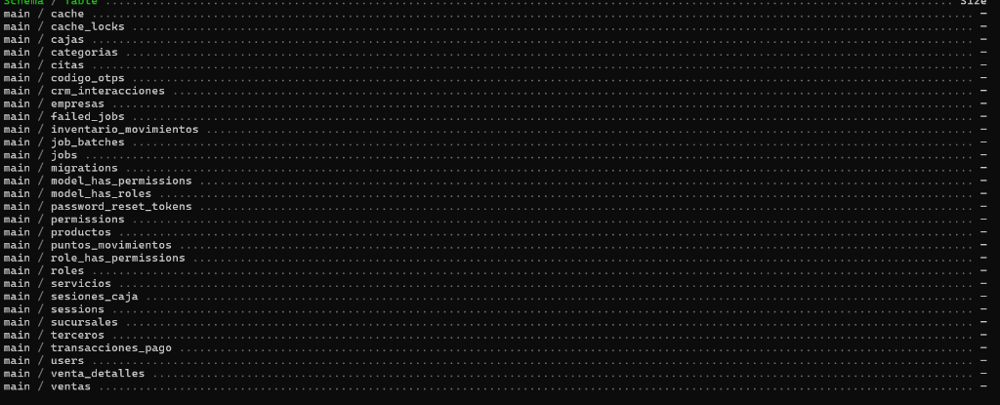
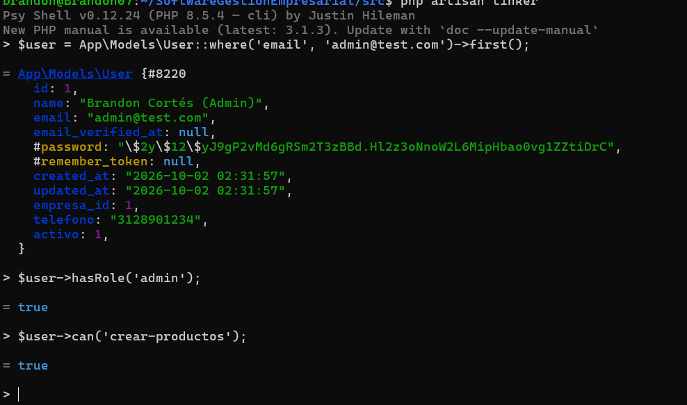
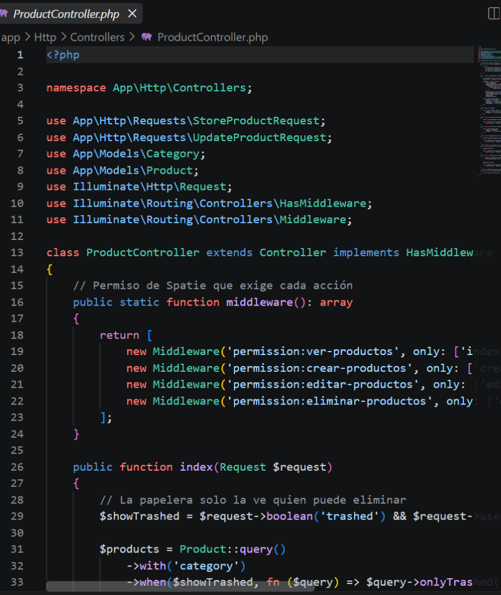
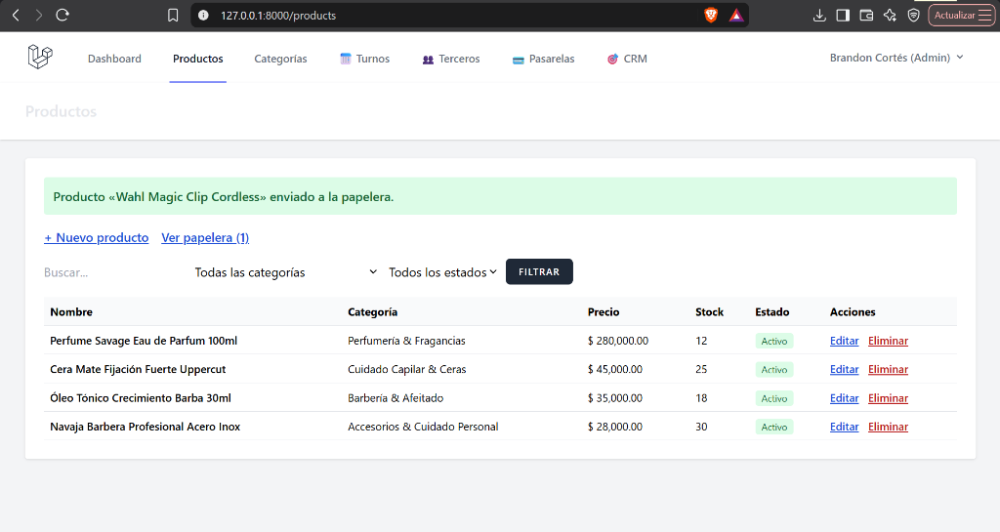
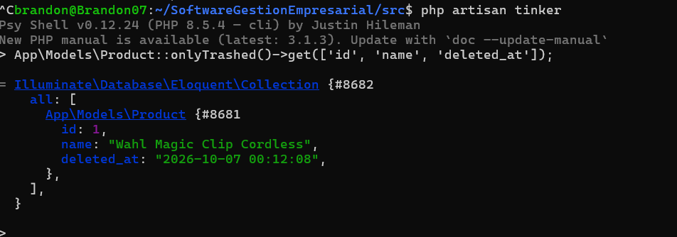
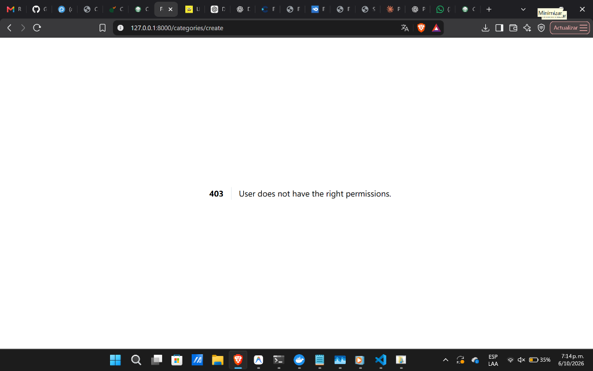

# Evidencias de Entrega — Clase 7: Roles, Permisos, Soft Delete y CRUD Completo
## Implementación de Seguridad RBAC (Spatie), Eliminación Lógica y Validaciones en el ERP

> **Institución:** Corporación de Estudios Tecnológicos del Norte del Valle (COTECNOVA) — Cartago, Valle  
> **Programa:** Tecnología en Gestión de Sistemas de Información  
> **Asignatura:** Seminario Desarrollo de Aplicaciones Web en Laravel con Enfoque RAD (2026)  
> **Docente:** Ing. Jhon James Cano Sánchez  
> **Integrantes:** Brandon Cortés Giraldo & Johan Sttive Linares Barragán  
> **Proyecto:** ERP Empresarial de Servicios y Gestión Comercial  
> **Repositorio Oficial:** [https://github.com/Brandon07-code/SoftwareGestionEmpresarial](https://github.com/Brandon07-code/SoftwareGestionEmpresarial)  

---

## 1. Resumen Técnico de la Sesión

En esta práctica de la Clase 7 se incorporaron los mecanismos profesionales de seguridad, autorización y persistencia segura en Laravel:

1. **Autenticación Base con Laravel Breeze:**
   * Módulo de inicio de sesión (`/login`), registro (`/register`) y cierre de sesión seguro mediante sesiones HTTP.
   * Componentes reutilizables de interfaz Blade (`<x-app-layout>`, `<x-input-label>`, etc.).

2. **Control de Acceso Basado en Roles (RBAC) con Spatie:**
   * Paquete industrial: `spatie/laravel-permission`.
   * Integración del trait `HasRoles` en el modelo `User.php`.
   * Registro de alias de middleware en `bootstrap/app.php`: `role`, `permission`, `role_or_permission`.
   * Matriz de permisos granulares (`ver-productos`, `crear-productos`, `eliminar-productos`, `ver-categorias`, `crear-citas`, etc.).
   * Definición de 3 roles operativos para el ERP: **`admin`**, **`vendedor`** (o cajero) y **`almacenista`** (o especialista).

3. **Eliminación Lógica Segura (Soft Delete):**
   * Migraciones con columna `deleted_at` en entidades críticas (`products`, `categories`).
   * Activación del trait `Illuminate\Database\Eloquent\SoftDeletes` en los modelos.
   * Gestión de papelera de reciclaje (`onlyTrashed()`) y restauración sin pérdida física de datos (`restore()`).

4. **Validaciones Desacopladas con Form Requests:**
   * Clases especializadas: `StoreProductRequest`, `UpdateProductRequest`, `StoreCategoryRequest`, `UpdateCategoryRequest`.
   * Sanitización previa mediante `prepareForValidation()` y reglas estrictas de integridad (`Rule::unique()->withoutTrashed()`).

5. **Protección Multicapa (Controladores y Vistas):**
   * Controladores que implementan `HasMiddleware` con `new Middleware('permission:...')`.
   * Restricción visual de botones y acciones en Blade mediante directivas `@can('...')` y `@role('...')`.
   * Emisión automática de código de estado HTTP **403 Forbidden** ante accesos no autorizados.

---

## 2. Matriz de Roles y Permisos Implementada

| Permiso / Acción | Rol: `admin` | Rol: `almacenista` | Rol: `vendedor` |
| :--- | :---: | :---: | :---: |
| `ver-productos` | ✅ Sí | ✅ Sí | ✅ Sí (Lectura) |
| `crear-productos` | ✅ Sí | ✅ Sí | ❌ No (403) |
| `editar-productos` | ✅ Sí | ✅ Sí | ❌ No (403) |
| `eliminar-productos` (Papelera / Restaurar) | ✅ Sí | ❌ No | ❌ No (403) |
| `ver-categorias` | ✅ Sí | ✅ Sí | ❌ No (403) |
| `crear-categorias` / `editar-categorias` | ✅ Sí | ❌ No | ❌ No (403) |
| `eliminar-categorias` | ✅ Sí | ❌ No | ❌ No (403) |
| `ver-ventas` / `crear-ventas` | ✅ Sí | ❌ No | ✅ Sí |
| `ver-compras` / `crear-compras` | ✅ Sí | ✅ Sí | ❌ No |

---

## 3. Evidencias de Entrega (Capturas de Pantalla)

### Evidencia 1: Tablas de Roles y Permisos creadas en la Base de Datos
Demuestra la migración exitosa de las tablas base de Spatie (`roles`, `permissions`, `model_has_roles`, `role_has_permissions`, etc.) en SQLite:



---

### Evidencia 2: Asignación y Comprobación de Roles en Tinker
Verificación mediante Laravel Tinker de que el usuario administrador (`admin@test.com`) posee el rol `admin` y el permiso `crear-productos`:



---

### Evidencia 3: Controlador Protegido con Middleware de Permisos
Implementación de la interfaz `HasMiddleware` en `ProductController.php`, protegiendo cada método REST (`index`, `create`, `store`, `edit`, `update`, `destroy`, `restore`) con su respectivo permiso granular de Spatie:



---

### Evidencia 4: Eliminación Lógica en Interfaz Web (Soft Delete)
Al ejecutar la acción de eliminar sobre el producto *«Wahl Magic Clip Cordless»*, el controlador aplica Soft Delete y redirige con un mensaje Flash de éxito verde indicando que el producto fue enviado a la papelera:



---

### Evidencia 5: Base de Datos con Columna `deleted_at` Poblada
Consulta en Laravel Tinker (`Product::onlyTrashed()->get(...)`) evidenciando que el producto eliminado conserva su integridad referencial y registra la marca de tiempo no nula en `deleted_at: "2026-10-07 00:12:08"`:



---

### Evidencia 6: Comprobación del Error 403 (Acceso Denegado)
Intento de acceso por URL directa a `/categories/create` autenticado como el rol `vendedor` (`vendedor@test.com`), bloqueado por el middleware de autorización con código HTTP **403 Forbidden | User does not have the right permissions**:



---

## 4. Instrucciones de Ejecución Local

```bash
cd /home/brandon/SoftwareGestionEmpresarial/src

# 1. Instalar dependencias de Laravel
composer install

# 2. Ejecutar migraciones y poblar datos (roles, permisos, categorías y productos)
php artisan migrate:fresh --seed

# 3. Iniciar el servidor de desarrollo
php artisan serve
```
