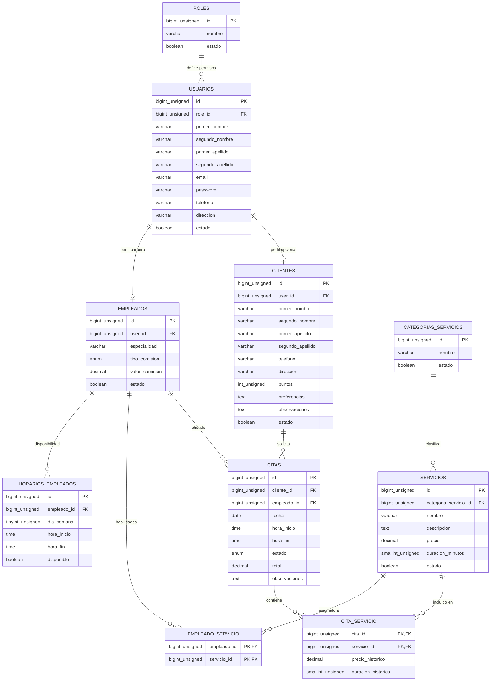
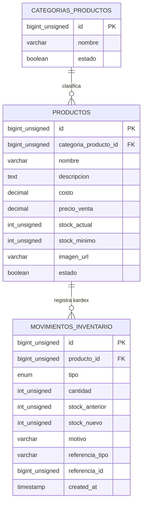
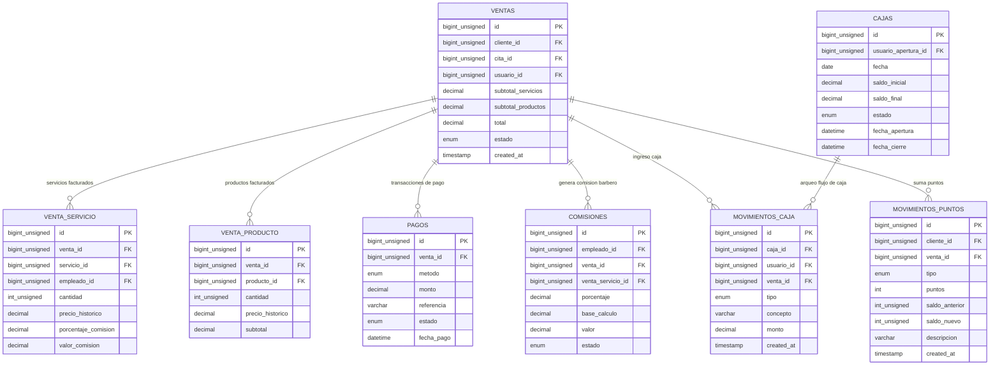
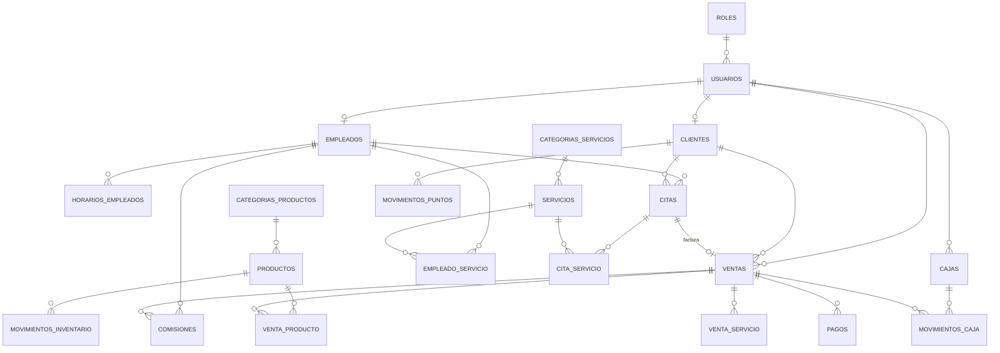

# 📐 Modelo Entidad - Relación (MER)
## Sistema de Gestión Empresarial (ERP) — Barbería y Perfumería JyM

> **Institución:** COTECNOVA — Cartago, Valle del Cauca  
> **Asignatura:** Software de Gestión Empresarial (2026)  
> **Docente:** Jhon James Cano Sánchez  
> **Estudiantes:** Brandon Cortés Giraldo & Johan  
> **Caso de Estudio:** Barbería y Perfumería JyM (Cartago, Valle)  

---

## 1. Diagramas MER Modulares (Renderizado Vectorial SVG Nítido en GitHub)

Para garantizar legibilidad total sin pixelado ni texto borroso, el modelo relacional (21 entidades) se desglosa a continuación en **diagramas vectoriales nativos de Mermaid**, organizados por submódulos con todos sus campos, tipos de datos, llaves primarias (PK) y foráneas (FK):

---

### 💈 Submódulo A: Usuarios, Personal, Clientes y Agenda (Citas & Servicios)

---

### 🧴 Submódulo B: Retail, Perfumería y Kárdex de Inventario

---

### 💵 Submódulo C: Facturación (POS), Pagos, Caja, Comisiones y Fidelización

---

## 2. Diagrama Global Simplificado (Mapa de Navegación de Entidades)

---

## 3. Diccionario de Datos Exhaustivo (21 Tablas)

### MÓDULO 1: Identidad, Accesos y Personal
1. **`roles`:** Catálogo de perfiles (`Administrador`, `Recepcionista/Cajero`, `Barbero/Estilista`).
2. **`usuarios`:** Credenciales maestras, nombres, apellidos, correo único, contraseña cifrada, teléfono y estado.
3. **`empleados`:** Perfil profesional del barbero vinculado a su usuario (`user_id` único), especialidad, tipo de liquidación (`porcentaje` o `valor_fijo`) y valor pactado.
4. **`horarios_empleados`:** Matriz de disponibilidad semanal por barbero (`dia_semana`, `hora_inicio`, `hora_fin`, `disponible`).
5. **`empleado_servicio`:** Habilidades profesionales (asocia qué servicios sabe realizar cada barbero).

### MÓDULO 2: Clientes y Fidelización (CRM)
6. **`clientes`:** Ficha de contacto y preferencias. Campo `user_id` **NULLABLE** para permitir registrar clientes de mostrador en Cartago sin correo ni cuenta web.
7. **`movimientos_puntos`:** Kárdex de fidelidad (`ganancia`, `redencion`, `ajuste`) con saldo anterior y nuevo.

### MÓDULO 3: Catálogo y Operación de Citas
8. **`categorias_servicios`:** Familias de atención (`Barbería`, `Peluquería`, `Spa`, `Estética`).
9. **`servicios`:** Tarifario base con precio actual y duración en minutos.
10. **`citas`:** Turnos de atención con ciclo de vida (`pendiente`, `confirmada`, `en_atencion`, `completada`, `cancelada`, `no_asistio`).
11. **`cita_servicio`:** Detalle multiproducto por cita con respaldo inmutable de `precio_historico` y `duracion_historica`.

### MÓDULO 4: Retail, Perfumería y Control de Stock
12. **`categorias_productos`:** Familias de retail (`Lociones Originales`, `Perfumes Réplica`, `Ceras y Pomadas`, `Cuidado de Barba`).
13. **`productos`:** Ficha de inventario con costo, precio de venta, stock actual y umbral de alerta de stock mínimo.
14. **`movimientos_inventario`:** Kárdex de almacén (`entrada`, `salida`, `ajuste`) con trazabilidad de motivo y documento de referencia.

### MÓDULO 5: Ventas, Facturación (POS), Caja y Comisiones
15. **`ventas`:** Ticket unificado de cobro. `cita_id` es **NULLABLE** para permitir compras de perfumería sin turno de motilada.
16. **`venta_servicio`:** Servicios liquidados en el ticket con congelamiento de `precio_historico`, `porcentaje_comision` y `valor_comision`.
17. **`venta_producto`:** Productos físicos facturados con `precio_historico` y subtotal.
18. **`pagos`:** Transacciones financieras (`efectivo`, `transferencia`, `qr`) con monto y código de referencia.
19. **`cajas`:** Turnos diarios de caja con saldo inicial, saldo final y marcas de tiempo de apertura y cierre.
20. **`movimientos_caja`:** Libro diario de ingresos y egresos de dinero físico en el punto de venta.
21. **`comisiones`:** Liquidaciones a favor del barbero generadas por cada servicio completado.

---

## 4. Pilares de Arquitectura Técnica

* **Inmutabilidad Contable:** Toda venta congela el precio y comisión del momento (`precio_historico`, `valor_comision`) para evitar que aumentos futuros de tarifas alteren cierres contables pasados.
* **Transaccionalidad Atómica:** Las operaciones de venta se ejecutan mediante `DB::transaction()` en un `VentaService`, garantizando que si falta stock de un perfume, la venta, la comisión y el movimiento de caja no se registren a medias.
* **Eliminación del problema N+1:** Consultas en Laravel optimizadas con Eager Loading (`with(['cliente', 'servicio', 'empleado'])`).
