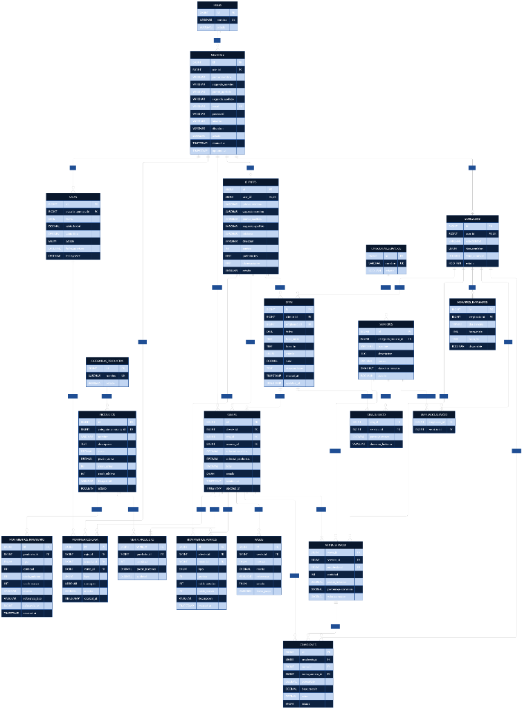
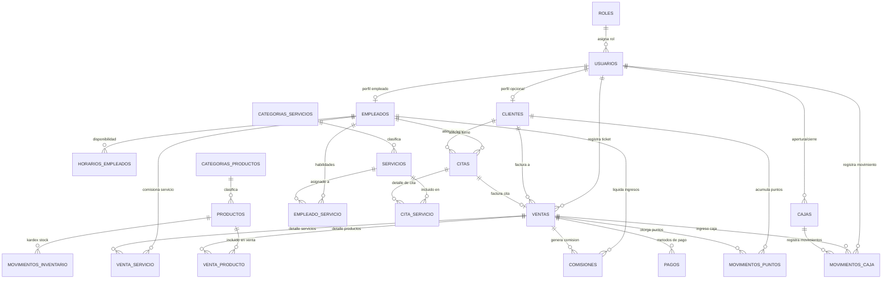

# 📐 Modelo Entidad - Relación (MER)
## Sistema de Gestión Empresarial (ERP) — Barbería y Perfumería JyM

> **Institución:** COTECNOVA — Cartago, Valle del Cauca  
> **Asignatura:** Software de Gestión Empresarial (2026)  
> **Docente:** Jhon James Cano Sánchez  
> **Estudiantes:** Brandon Cortés Giraldo & Johan  
> **Caso de Estudio:** Barbería y Perfumería JyM (Cartago, Valle)  

---

## 1. Diagrama Visual de la Base de Datos

A continuación se presenta el diseño relacional integral del ERP (21 entidades) estructurado bajo estándares de normalización y optimización para Laravel / Eloquent ORM:

---

## 2. Diagrama MER en Formato Mermaid (Interactivo)

---

## 3. Diccionario de Datos por Módulos

### MÓDULO I: Autenticación, Usuarios y Personal
* **`roles`:** Define los permisos y niveles de acceso (`Administrador`, `Recepcionista/Cajero`, `Barbero/Estilista`).
* **`usuarios`:** Credenciales de acceso, datos personales principales (`primer_nombre`, `primer_apellido`, `email`, `password`, `telefono`).
* **`empleados`:** Perfil laboral del barbero (`user_id`, `especialidad`, `tipo_comision` ['porcentaje', 'valor_fijo'], `valor_comision`).
* **`horarios_empleados`:** Disponibilidad laboral semanal por día y rango de horas (`dia_semana`, `hora_inicio`, `hora_fin`, `disponible`).
* **`empleado_servicio`:** Tabla intermedia que mapea qué servicios específicos está capacitado para realizar cada barbero.

### MÓDULO II: Clientes y Fidelización (CRM)
* **`clientes`:** Expediente del cliente (`primer_nombre`, `primer_apellido`, `telefono`, `direccion`, `puntos`, `preferencias`, `observaciones`).
  * *Nota técnica:* `user_id` es **NULLABLE**, permitiendo registrar clientes de Cartago que no usan cuenta web.
* **`movimientos_puntos`:** Libro mayor de fidelización (`cliente_id`, `venta_id`, `tipo` ['ganancia', 'redencion', 'ajuste'], `puntos`, `saldo_anterior`, `saldo_nuevo`).

### MÓDULO III: Catálogo y Gestión de Citas (Core Operativo)
* **`categorias_servicios`:** Agrupación temática (`Barbería`, `Peluquería`, `Spa`, `Estética`).
* **`servicios`:** Catálogo oficial con tarifas y tiempos (`categoria_servicio_id`, `nombre`, `precio`, `duracion_minutos`, `estado`).
* **`citas`:** Cabecera de agenda (`cliente_id`, `empleado_id`, `fecha`, `hora_inicio`, `hora_fin`, `estado`, `total`, `observaciones`).
* **`cita_servicio`:** Tabla intermedia que permite citas con múltiples servicios simultáneos con respaldo de `precio_historico` y `duracion_historica`.

### MÓDULO IV: Retail, Perfumería e Inventario
* **`categorias_productos`:** Familias de productos (`Perfumes Importados`, `Perfumes Réplica`, `Ceras y Pomadas`, `Cuidado de Barba`).
* **`productos`:** Ficha de producto con control de costos y existencias (`categoria_producto_id`, `nombre`, `costo`, `precio_venta`, `stock_actual`, `stock_minimo`).
* **`movimientos_inventario`:** Kárdex inmutable (`producto_id`, `tipo` ['entrada', 'salida', 'ajuste'], `cantidad`, `stock_anterior`, `stock_nuevo`, `motivo`, `referencia_tipo`, `referencia_id`).

### MÓDULO V: Facturación (POS), Pagos, Caja y Comisiones
* **`ventas`:** Ticket unificado de la visita (`cliente_id`, `cita_id` *[NULLABLE para ventas directas de mostrador]*, `usuario_id`, `subtotal_servicios`, `subtotal_productos`, `total`, `estado`).
* **`venta_servicio`:** Desglose de servicios facturados (`venta_id`, `servicio_id`, `empleado_id`, `precio_historico`, `porcentaje_comision`, `valor_comision`).
* **`venta_producto`:** Desglose de productos vendidos (`venta_id`, `producto_id`, `cantidad`, `precio_historico`, `subtotal`).
* **`pagos`:** Transacciones financieras (`venta_id`, `metodo` ['efectivo', 'transferencia', 'qr'], `monto`, `referencia`, `estado`, `fecha_pago`).
* **`cajas`:** Arqueo diario de caja (`usuario_apertura_id`, `fecha`, `saldo_inicial`, `saldo_final`, `estado`, `fecha_apertura`, `fecha_cierre`).
* **`movimientos_caja`:** Flujo de efectivo (`caja_id`, `usuario_id`, `venta_id`, `tipo` ['ingreso', 'egreso', 'ajuste'], `concepto`, `monto`).
* **`comisiones`:** Liquidación individual a barberos (`empleado_id`, `venta_id`, `venta_servicio_id`, `porcentaje`, `base_calculo`, `valor`, `estado` ['pendiente', 'liquidada', 'pagada']).

---

## 4. Principios Clave de la Arquitectura de Software

1. **Inmutabilidad Financiera:**  
   Los campos `precio_historico` y `valor_comision` garantizan que cualquier cambio futuro en las tarifas de JyM no altere la contabilidad ni los reportes históricos.
2. **Desacople Operativo (Cita vs. Venta):**  
   Al permitir que `cita_id` sea nulo en `ventas`, el sistema actúa como Punto de Venta (POS) independiente para ventas de perfumería al paso.
3. **Transaccionalidad Atómica (`VentaService` + `DB::transaction`):**  
   Al facturar una venta, el descuento de inventario, registro de comisiones, movimiento de caja y acumulación de puntos se ejecutan en una sola transacción segura con *Rollback* automático ante fallas.
4. **Optimización contra el problema N+1:**  
   Uso de Eager Loading en Eloquent (`with(['cliente', 'servicio', 'empleado'])`) para garantizar alto rendimiento con consultas SQL consolidadas.
