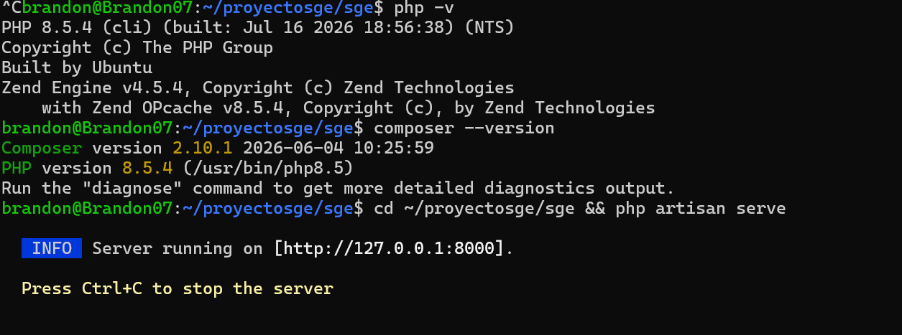
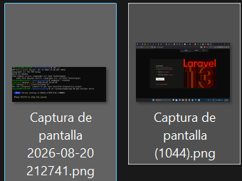
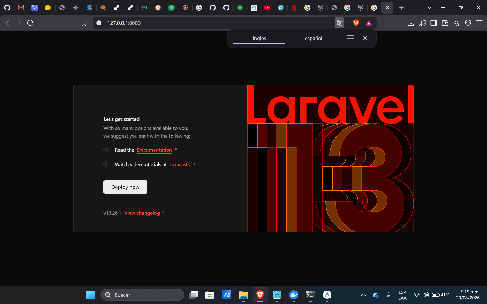

# Software de Gestión Empresarial

> **Estudiante:** Brandon  
> **Institución:** Cotecnova — Cartago, Valle del Cauca  
> **Asignatura:** Software de Gestión Empresarial  
> **Docente:** James Cano  
> **Stack:** Laravel · PHP · Eloquent ORM · MySQL · Docker  

---

## 📁 Estructura del Repositorio

| Carpeta / Archivo | Descripción |
|-------------------|-------------|
| [`Clase2/`](./Clase2/) | Evidencias y capturas de la instalación del entorno y Laravel |
| [`propuestas.md`](./propuestas.md) | Propuestas de proyecto ERP para evaluación del docente |

---

## 🚀 Instalación de Laravel (Clase 2)

### 1. Verificación del Entorno
* **PHP:** Versión `8.5.4` con extensiones requeridas (`pdo_mysql`, `sqlite3`, `mbstring`, `curl`).
* **Composer:** Versión `2.10.1` instalada en Ubuntu WSL2.

### 2. Creación del Proyecto
El proyecto base de Laravel fue creado mediante Composer con el comando:
```bash
composer create-project laravel/laravel sge
```

### 3. Ejecución del Servidor
Para iniciar el servidor de desarrollo local se ejecuta:
```bash
php artisan serve
```
El servidor queda disponible en `http://127.0.0.1:8000`.

---

## 📸 Evidencias de la Instalación (Clase 2)

### Captura 1 — Verificación de PHP y Composer


### Captura 2 — Estructura del Proyecto Laravel (`ls -la`)


### Captura 3 — Pantalla de Bienvenida de Laravel en el Navegador


---

## 🐳 Entorno con Docker (Servicios)

- **PHP / Apache** → `http://localhost:8085`
- **MariaDB** → `localhost:3307`
- **phpMyAdmin** → `http://localhost:8086`

Repositorio base del entorno: [jamescanos/SoftwareGestionEmpresarial](https://github.com/jamescanos/SoftwareGestionEmpresarial)

---

*Cartago, Valle del Cauca — 2026*
