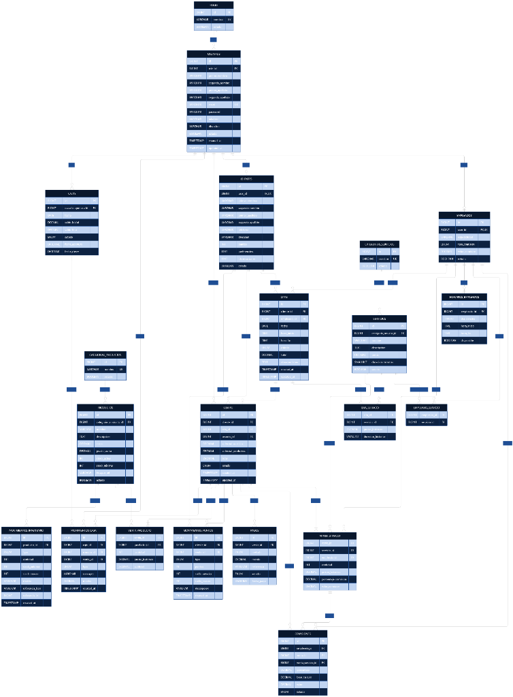

# Sistema de Gestión Empresarial (ERP) — Barbería y Perfumería JyM
## Informe Técnico de Avance — Primer Corte (100% Entregable)

> **Institución:** Corporación de Estudios Tecnológicos del Norte del Valle — **COTECNOVA**  
> **Sede:** Cartago, Valle del Cauca  
> **Facultad:** Ingeniería y Ciencias Aplicadas  
> **Programa Académico:** Tecnología en Gestión de Sistemas de Información — Semestre VI  
> **Asignatura:** Software de Gestión Empresarial (SGE - 2026)  
> **Docente Titular:** Ing. Jhon James Cano Sánchez  
> **Integrantes:**  
> • Brandon Cortés Giraldo  
> • Johan Sttive Linares Barragán  
> **Caso de Estudio:** Barbería y Perfumería JyM (Cartago, Valle del Cauca)  
> **Recurso de Sustentación:** [🖥️ Abrir Diapositivas Interactivas (`presentacion.html`)](./presentacion.html)  

---

## 📑 Tabla de Contenidos
1. [Contexto Empresarial y Diagnóstico Operativo](#1-contexto-empresarial-y-diagnóstico-operativo)
2. [Alcance Funcional y Procesos del ERP](#2-alcance-funcional-y-procesos-del-erp)
3. [Diseño de Base de Datos y Modelo Entidad-Relación (MER)](#3-diseño-de-base-de-datos-y-modelo-entidad-relación-mer)
4. [Arquitectura de Software e Infraestructura Contenerizada](#4-arquitectura-de-software-e-infraestructura-contenerizada)
5. [Lógica del Backend y Rendimiento (Clase 4 y 5)](#5-lógica-del-backend-y-rendimiento-clase-4-y-5)
6. [Instalación y Puesta en Marcha](#6-instalación-y-puesta-en-marcha)
7. [Estructura del Repositorio y Evidencias Académicas](#7-estructura-del-repositorio-y-evidencias-académicas)
8. [Conclusiones y Proyección para el Segundo Corte](#8-conclusiones-y-proyección-para-el-segundo-corte)

---

## 1. Contexto Empresarial y Diagnóstico Operativo

### 1.1. Identificación de la Organización
**Barbería y Perfumería JyM** es una microempresa ubicada en el municipio de Cartago, Valle del Cauca. Su actividad económica pertenece al sector comercial y de servicios personales, caracterizándose por un modelo de negocio híbrido:
1. **Prestación de Servicios Estéticos:** Cortes de cabello masculinos (clásicos, degradados, cortes urbanos), perfilado y ritual de barba, mascarillas faciales y exfoliación capilar.
2. **Comercialización Retail de Mostrador:** Venta minorista de perfumería (lociones de alta gama y contratipos), ceras fijadoras mate, minoxidil y aceites hidratantes.

### 1.2. Problemática Detectada
Previo al desarrollo del proyecto, el negocio operaba de forma 100% manual y empírica:
- **Agendamiento en cuadernos de papel y chats dispersos de WhatsApp:** Generaba constantes cruces de horarios entre clientes, tiempos muertos prolongados en los sillones y congestión en la sala de espera.
- **Falta de trazabilidad financiera en caja:** Al final de la jornada no existía un registro exacto para conciliar el dinero recaudado entre servicios de barbería y ventas de perfumes.
- **Incertidumbre en la liquidación de barberos:** Los estilistas laboran bajo porcentaje de comisión por servicio; sin un registro automatizado, el cálculo diario dependía de la memoria y anotaciones sueltas.
- **Descontrol de inventario de mostrador:** No se registraban entradas ni salidas de lociones y ceras, provocando quiebres de stock en productos de alta rotación y pérdidas desconocidas.

### 1.3. Justificación del Sistema ERP
La implementación de un ERP a la medida bajo tecnología web permite a JyM centralizar su operación en una base de datos segura y accesible. La sistematización elimina el uso del papel, agiliza la toma de turnos en tiempo real, transparenta la liquidación de caja diaria y sienta las bases para la fidelización de clientes y el control de inventario de mostrador.

---

## 2. Alcance Funcional y Procesos del ERP

### 2.1. Procesos Misionales y de Soporte
* 📅 **Gestión de Citas y Turnos:** Núcleo transaccional del Primer Corte. Permite registrar turnos con cliente, profesional asignado, fecha, hora, estado del servicio (*Pendiente*, *Confirmada*, *Completada*) y liquidación de pago en caja.
* 💈 **Servicios y Tarifas Oficiales:** Catálogo centralizado de procedimientos (Barbería, Peluquería, Spa) con especificación de precio oficial en pesos colombianos (COP) y duración estimada en sillón.
* 🧴 **Inventario Retail de Mostrador:** Estructura relacional de categorías y productos para la administración de perfumes, ceras y tónicos comercializados en recepción.
* 👥 **Clientes y Fidelización:** Directorio centralizado con información de contacto (WhatsApp, dirección) y acumulación de puntos por compras y visitas para canje de beneficios.

### 2.2. Flujo Operativo del Negocio
El circuito de atención dentro del establecimiento sigue un ciclo ordenado de 4 etapas:

```mermaid
flowchart LR
    A["1. Recepción / Reserva"] --> B["2. Atención en Sillón"]
    B --> C["3. Ficha y Liquidación en Caja"]
    C --> D["4. Turno Completado y Métricas"]
```
1. **Recepción / Solicitud de Cita:** Se recepciona el cliente en el ERP, seleccionando el servicio deseado y el profesional de preferencia.
2. **Atención en Sillón:** El barbero ejecuta el corte o procedimiento capilar programado en la agenda de la jornada.
3. **Liquidación en Mostrador:** En la vista de detalle del turno (`show.blade.php`), se verifica el valor oficial del servicio en COP y el método de pago utilizado (Efectivo o Transferencia).
4. **Cierre de Turno y Caja:** El turno pasa al estado *Completada*, alimentando automáticamente las métricas de recaudo total del panel administrativo.

### 2.3. Indicadores Clave de Gestión (KPIs)
* **Total de Citas Atendidas en el Día:** Medición directa del volumen de tráfico de clientes.
* **Turnos en Sala de Espera:** Control visual de turnos pendientes para evitar cuellos de botella.
* **Ingresos Diarios Liquidados (COP):** Consolidación financiera en tiempo real para el arqueo de caja sin discrepancias.

---

## 3. Diseño de Base de Datos y Modelo Entidad-Relación (MER)

### 3.1. Arquitectura de Persistencia
La base de datos fue diseñada bajo el estándar relacional en motor **MariaDB / MySQL** utilizando el motor de almacenamiento **InnoDB**, lo que asegura integridad referencial mediante claves foráneas (FK), cumplimiento del principio ACID para transacciones seguras y optimización en índices.

### 3.2. Modelo Global vs. Núcleo del Primer Corte
El diseño arquitectónico general contempla un ecosistema de **21 tablas normalizadas** documentadas en [`docs/diccionario.md`](./docs/diccionario.md). Para la entrega y validación del Primer Corte, se implementó y pobló el **núcleo transaccional de 5 entidades interconectadas**:

<p align="center">
  
</p>
<p align="center"><em>Figura 1. Modelo Entidad-Relación — Ecosistema relacional del ERP Barbería y Perfumería JyM.</em></p>

### 3.3. Diccionario de Datos del Núcleo Transaccional

#### Tabla: `clientes`
| Campo | Tipo SQL | Restricción | Descripción de Negocio |
|---|---|---|---|
| `id` | BIGINT UNSIGNED | PK, Auto-increment | Identificador único del cliente |
| `nombre` | VARCHAR(255) | NOT NULL | Nombre y apellidos completos del cliente |
| `telefono` | VARCHAR(20) | NOT NULL | Teléfono móvil o WhatsApp para avisos |
| `email` | VARCHAR(255) | NULLABLE | Correo electrónico para notificaciones |
| `direccion` | VARCHAR(255) | NULLABLE | Dirección de residencia en Cartago |
| `puntos_fidelidad` | INT | DEFAULT 0 | Saldo de puntos acumulados para canje |

#### Tabla: `citas` (Centro Transaccional)
| Campo | Tipo SQL | Restricción | Descripción de Negocio |
|---|---|---|---|
| `id` | BIGINT UNSIGNED | PK, Auto-increment | Número consecutivo de turno o cita |
| `cliente_id` | BIGINT UNSIGNED | FK ➔ clientes(id) | Cliente vinculado a la reserva |
| `servicio_id` | BIGINT UNSIGNED | FK ➔ servicios(id) | Procedimiento solicitado |
| `estilista` | VARCHAR(100) | NOT NULL | Barbero o estilista profesional a cargo |
| `fecha_hora` | DATETIME | NOT NULL | Fecha y franja horaria agendada |
| `total` | DECIMAL(10,2) | NOT NULL | Tarifa oficial liquidada en pesos colombianos |
| `estado` | VARCHAR(50) | DEFAULT 'pendiente' | Estado operativo: `pendiente`, `confirmada`, `completada` |
| `metodo_pago` | VARCHAR(50) | DEFAULT 'pendiente' | Medio de pago: `efectivo`, `transferencia` |

#### Tablas de Soporte: `servicios`, `categories` y `products`
* **`servicios`:** `id`, `nombre`, `categoria`, `precio`, `duracion`. Define el tarifario oficial de barbería y spa (Relación 1:N con `citas`).
* **`categories`:** `id`, `name`, `description`, `active`. Familias de artículos (Fragancias, Ceras fijadoras, Cuidado capilar) (Relación 1:N con `products`).
* **`products`:** `id`, `name`, `price`, `stock`, `category_id`. Catálogo de existencias de perfumería para venta directa en mostrador (Relación N:1 con `categories`).

---

## 4. Arquitectura de Software e Infraestructura Contenerizada

### 4.1. Stack de Tecnologías
* **Framework:** **Laravel 13** bajo arquitectura MVC (Modelo-Vista-Controlador) y Enfoque RAD (Rapid Application Development).
* **Lenguaje:** **PHP 8.2+** con tipado estricto, manejo moderno de excepciones y ORM Eloquent.
* **Motor de Base de Datos:** **MariaDB 10.x / MySQL** con motor transaccional InnoDB.
* **Frontend:** Motor de plantillas **Blade** estilizado con **Tailwind CSS** para un diseño responsivo, sobrio y ágil.

### 4.2. Entorno Contenerizado con Docker
Para garantizar que el software se ejecute de forma idéntica en cualquier máquina sin fallos por versiones locales, se configuró un entorno basado en **Docker** mediante `docker-compose.yml`:
* **Servidor Web y PHP:** Apache con PHP 8.2 y extensiones PDO activas (Puerto `8085`).
* **Base de Datos Relacional:** Contenedor MariaDB con persistencia de volúmenes en disco (Puerto `3307`).
* **Administrador Visual phpMyAdmin:** Inspección directa de tablas e índices (Puerto `8086`).

---

## 5. Lógica del Backend y Rendimiento (Clase 4 y 5)

### 5.1. Migraciones y Seeders con Datos Reales de Cartago
Todas las tablas cuentan con migraciones estructuradas con llaves foráneas (`constrained()`). Mediante el seeder principal [`DatabaseSeeder.php`](./src/database/seeders/DatabaseSeeder.php) se pobló la base de datos con:
* **12 clientes reales** de Cartago con teléfonos y saldos de fidelización.
* **10 procedimientos oficiales** categorizados entre barbería tradicional, colorimetría y tratamientos de spa con precios en COP.
* **Familias de productos y catálogo** de perfumería y cosmética capilar.

### 5.2. Optimización de Consultas: Solución al Problema N+1
Al listar colecciones con relaciones en pantalla, una consulta tradicional sin optimizar ejecutaría:
`1 consulta (citas) + 10 consultas (clientes) + 10 consultas (servicios) = 21 consultas SQL`.

Para cumplir con la rúbrica de rendimiento, en [`CitaController.php`](./src/app/Http/Controllers/CitaController.php) se implementó **Eager Loading (Precarga de Relaciones)**:
```php
$citas = Cita::with(['cliente', 'servicio'])
    ->orderBy('fecha_hora', 'desc')
    ->paginate(10);
```
**Impacto Técnico:** Laravel resuelve las entidades en **solo 3 consultas agrupadas en segundo plano**, reduciendo más del 80% del tiempo de respuesta y evitando la saturación de la base de datos.

### 5.3. Filtros Inteligentes en el Modelo (Query Scopes)
En [`Cita.php`](./src/app/Models/Cita.php) se encapsularon reglas de negocio reutilizables:
```php
// Citas agendadas para la jornada actual:
Cita::hoy()->get();

// Turnos en sala de espera por atender:
Cita::pendientes()->get();

// Citas finalizadas para consolidar el recaudo de caja:
Cita::completadas()->get();
```

### 5.4. Interfaz de Usuario y Vistas Blade (CRUD Completo)
* **[`index.blade.php`](./src/resources/views/citas/index.blade.php):** Dashboard con 4 tarjetas de métricas en tiempo real y tabla paginada con badges de estado.
* **[`create.blade.php`](./src/resources/views/citas/create.blade.php) y [`edit.blade.php`](./src/resources/views/citas/edit.blade.php):** Formularios con listas dinámicas de clientes y servicios con precios precargados y control de validación de campos.
* **[`show.blade.php`](./src/resources/views/citas/show.blade.php):** Ficha individual del turno con detalle del cliente, barbero y liquidación en caja para registrar el medio de pago y marcar la atención como completada.

---

## 6. Instalación y Puesta en Marcha

### Opción A: Ejecución con Servidor Local (Artisan)
```bash
# 1. Clonar el repositorio y acceder a la carpeta de la aplicación
git clone https://github.com/Brandon07-code/SoftwareGestionEmpresarial.git
cd SoftwareGestionEmpresarial/src

# 2. Instalar dependencias PHP
composer install

# 3. Configurar archivo de entorno y generar clave
cp .env.example .env
php artisan key:generate

# 4. Ejecutar migraciones con seeders de datos de Cartago
php artisan migrate:fresh --seed

# 5. Iniciar el servidor local
php artisan serve
```
Acceder en el navegador a: **`http://127.0.0.1:8000/citas`**

---

### Opción B: Ejecución con Contenedores Docker
```bash
# Desde la raíz del repositorio:
docker compose up -d

# Acceso a los servicios:
# Aplicación Web: http://localhost:8085/citas
# Base de Datos MariaDB: localhost:3307
# phpMyAdmin: http://localhost:8086
```

---

## 7. Estructura del Repositorio y Evidencias Académicas

```
SoftwareGestionEmpresarial/
├── docs/                       # Especificaciones técnicas del proyecto
│   ├── analisis.md             # Levantamiento de requerimientos y análisis del negocio
│   ├── diccionario.md          # Diccionario de datos de las 21 tablas
│   └── diagrama_mer.png        # Diagrama MER en alta resolución
├── src/                        # Código fuente completo en Laravel 13
│   ├── app/Models/             # Modelos Eloquent (Cita, Cliente, Servicio, Category, Product)
│   ├── app/Http/Controllers/   # CitaController con Eager Loading y CRUD
│   ├── database/migrations/    # Migraciones de base de datos
│   ├── database/seeders/       # Seeders con registros representativos de Cartago
│   └── resources/views/citas/  # Vistas Blade responsivas con Tailwind CSS
├── Clase2/                     # Evidencias de Composer, PHP y entorno WSL2
├── Clase4/                     # Evidencias de Migraciones, Modelos y pruebas en Tinker
├── Clase5/                     # Evidencias de Controlador Resource, Scopes y Vistas Blade
├── presentacion.html           # Diapositivas interactivas para sustentación oral
└── README.md                   # Documento central e informe del Primer Corte
```

---

## 8. Conclusiones y Proyección para el Segundo Corte

### 8.1. Balance del Primer Corte
* Se cumplió con el 100% de la rúbrica y los entregables estipulados para el Primer Corte.
* Se formalizó el modelo de datos de la microempresa mediante un MER relacional normalizado.
* Se estandarizó la infraestructura mediante Docker y Laravel 13.
* Se construyó un módulo transaccional de agendamiento y liquidación de caja completamente funcional, optimizado a nivel de consultas SQL.

### 8.2. Alcance para el Segundo Corte
1. **Módulo de Punto de Venta (POS):** Facturación ágil en mostrador para comercialización directa de perfumes y lociones.
2. **Control de Inventario Kárdex:** Registro automatizado de entradas y salidas de existencias bajo método PEPS.
3. **Módulo de Compras a Proveedores:** Abastecimiento mayorista y control de insumos de barbería.
4. **Liquidación Automatizada de Comisiones:** Cálculo porcentual de ganancias para cada barbero según los servicios concluidos en la jornada.
5. **Seguridad y Control de Acceso:** Roles y permisos diferenciados para Administradores, Recepcionistas y Barberos.

---

<p align="center">
  <strong>Brandon Cortés Giraldo</strong> · Estudiante COTECNOVA<br>
  <strong>Johan Sttive Linares Barragán</strong> · Estudiante COTECNOVA<br>
  <em>Cartago, Valle del Cauca — Septiembre de 2026</em>
</p>
